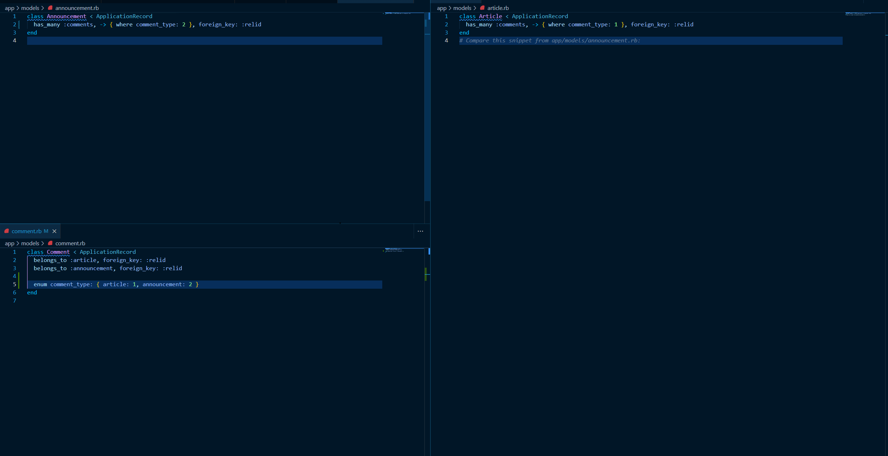

# README

## Proof of concept (a bad example of a pseudo polymorphic relationship)

### Model Relationships

## Installation

1. clone repository
2. `bundle install`
3. `rails db:create`
4. `rails db:migrate`

## Run script that showcases the model relationships

1. `rails runner script.rb`

*Use this code at your own risk*