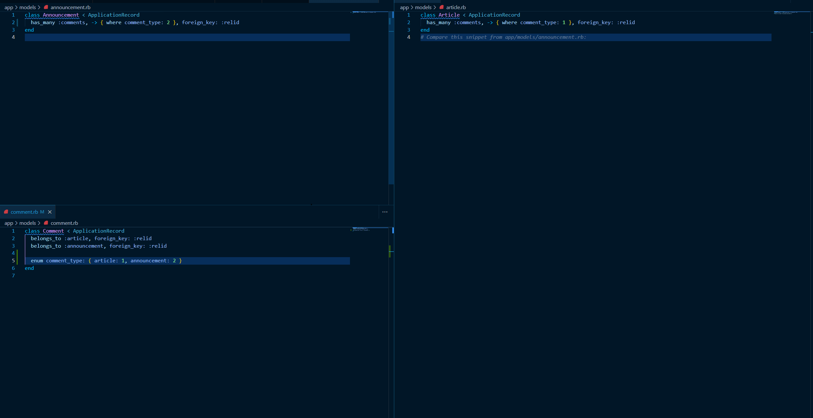

# README

## Proof of concept (a bad example of a pseudo polymorphic relationship)

### Model Relationships



## Installation

1. clone repository
2. `bundle install`
3. `rails db:create`
4. `rails db:migrate`

## Run script that showcases the model relationships

1. `rails runner script.rb`

Output:
```
Creating First Article
#<Article:0x00007f496bbe16b0 id: 1, name: "first article", created_at: Fri, 01 Mar 2024 02:35:05.894242000 UTC +00:00, updated_at: Fri, 01 Mar 2024 02:35:05.894242000 UTC +00:00>


Creating First Announcement
#<Announcement:0x00007f496acc6860 id: 1, name: "first announcement", created_at: Fri, 01 Mar 2024 02:35:05.929429000 UTC +00:00, updated_at: Fri, 01 Mar 2024 02:35:05.929429000 UTC +00:00>


Creating First Comment
#<Comment:0x00007f496b397748
 id: 1,
 name: "first article comment",
 comment_type: "article",
 relid: 1,
 created_at: Fri, 01 Mar 2024 02:35:05.953505000 UTC +00:00,
 updated_at: Fri, 01 Mar 2024 02:35:05.953505000 UTC +00:00>


Article has one comment. Good!
[#<Comment:0x00007f496b5ccd10
  id: 1,
  name: "first article comment",
  comment_type: "article",
  relid: 1,
  created_at: Fri, 01 Mar 2024 02:35:05.953505000 UTC +00:00,
  updated_at: Fri, 01 Mar 2024 02:35:05.953505000 UTC +00:00>]


Announcement has no comments. Good!
[]


The first Comment belongs to article. Good!
#<Article:0x00007f496ca20a00 id: 1, name: "first article", created_at: Fri, 01 Mar 2024 02:35:05.894242000 UTC +00:00, updated_at: Fri, 01 Mar 2024 02:35:05.894242000 UTC +00:00>


The same comment also belongs to announcement. Uhm....
#<Announcement:0x00007f496ac344d8 id: 1, name: "first announcement", created_at: Fri, 01 Mar 2024 02:35:05.929429000 UTC +00:00, updated_at: Fri, 01 Mar 2024 02:35:05.929429000 UTC +00:00>
```


*Use this code at your own risk*
